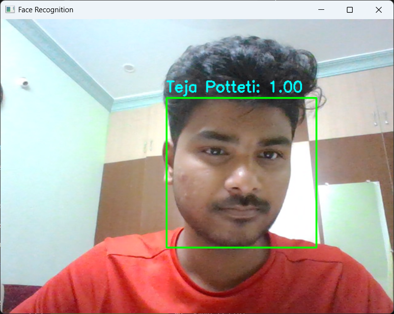

# Face Recognition System using CNN

This is a Python-based project that implements a real-time face recognition system. The application uses a Convolutional Neural Network (CNN) for training and predicting faces captured from a webcam. The project was developed mainly for learning and demonstrating concepts in computer vision and deep learning.

---

## 📌 Features

- Capture face images from the webcam and create a dataset
- Train a CNN model to classify and recognize faces
- Recognize faces in real time with confidence scores
- Save and load trained models for future predictions

---

## 🛠️ Technologies Used

- Python 3.10
- TensorFlow
- Keras
- OpenCV
- NumPy
- scikit-learn

---
---

## 🧠 Model Architecture

The CNN model used in this project consists of the following layers:

- **Convolutional Layers:** Extract spatial features from input images.
- **Max Pooling Layers:** Downsample feature maps to reduce dimensionality.
- **Flatten Layer:** Converts 2D features into a 1D vector.
- **Dense Layers:** Fully connected layers for classification.
- **Output Layer:** Softmax activation to predict class probabilities.

This simple architecture was chosen for demonstration purposes and can be extended further for improved accuracy.

---

## ⚙️ Dataset Details

- Images are captured live from the user's webcam.
- Each person has 50 images stored for training.
- Images are resized to **128x128** pixels before being fed into the CNN.
- The dataset is saved locally in a folder named `faces_dataset`.

---

## 📊 Evaluation

During training, you can observe the following metrics:

- **Training Accuracy:** Measures how well the model fits the training data.
- **Loss:** Cross-entropy loss during training epochs.
- **Confidence Scores:** Predicted probabilities shown during recognition.

Due to the small dataset size, the model may overfit or produce varying results.

---

## 💡 Tips for Best Results

- Capture images in consistent lighting conditions.
- Avoid extreme head angles or occlusions (e.g., covering face).
- Train the model separately for each user to improve accuracy.
- You can increase the dataset size to get better performance.

---

## 💼 Use Cases

This project can be adapted for:

- Basic security applications
- Classroom attendance systems
- Personalized user experiences
- Demonstration of computer vision concepts

---
---

## 🛠️ Installation Guide (IMPORTANT: Python 3.10 REQUIRED)

⚠️ **Note:**  
This project requires **Python 3.10**.  
TensorFlow and OpenCV may **not work properly** with Python 3.11, 3.12, or 3.13.

---
---

## 📷 Example Output Screenshot

Below is an example of the application running in real-time recognition mode.  
The model predicts the person's name with a confidence score.

> ℹ️ **Note:**  
This image was captured during testing on my machine. The bounding box shows face detection, and the label indicates the recognized name and accuracy percentage.

---
